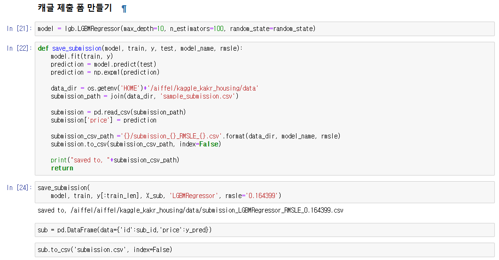
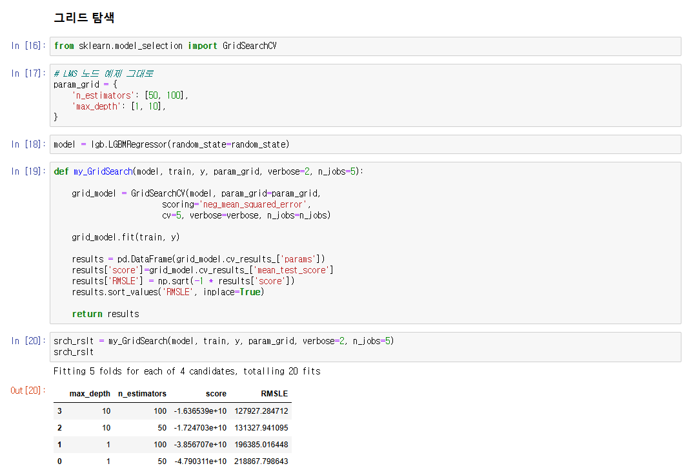
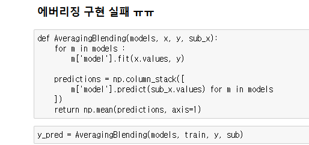
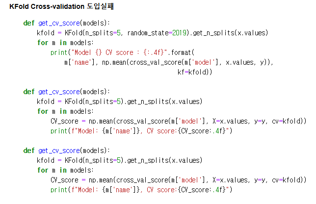

# AIFFEL Campus Online Code Peer Review Templete
- 코더 : 정우철
- 리뷰어 : 김영민


# PRT(Peer Review Template)
- [x]  **1. 주어진 문제를 해결하는 완성된 코드가 제출되었나요?**
    - 문제에서 요구하는 최종 결과물이 첨부되었는지 확인
        - 중요! 해당 조건을 만족하는 부분을 캡쳐해 근거로 첨부
        - 케글 제출 폼에 맞게 데이터를 성형해서 제출하였습니다.
        
        ```python
        model = lgb.LGBMRegressor(max_depth=10, n_estimators=100, random_state=random_state)
        
        def save_submission(model, train, y, test, model_name, rmsle):
            model.fit(train, y)
            prediction = model.predict(test)
            prediction = np.expm1(prediction)
    
            data_dir = os.getenv('HOME')+'/aiffel/kaggle_kakr_housing/data'
            submission_path = join(data_dir, 'sample_submission.csv')
    
            submission = pd.read_csv(submission_path)
            submission['price'] = prediction
    
            submission_csv_path ='{}/submission_{}_RMSLE_{}.csv'.format(data_dir, model_name, rmsle)
            submission.to_csv(submission_csv_path, index=False)
    
            print("saved to, "+submission_csv_path)
            return
            
        save_submission(
            model, train, y[:train_len], X_sub, 'LGBMRegressor', rmsle='0.164399')
            
        sub = pd.DataFrame(data={'id':sub_id,'price':y_pred})
        
        sub.to_csv('submission.csv', index=False)
        ```
        
    
- [x]  **2. 전체 코드에서 가장 핵심적이거나 가장 복잡하고 이해하기 어려운 부분에 작성된 
주석 또는 doc string을 보고 해당 코드가 잘 이해되었나요?**
    - 해당 코드 블럭을 왜 핵심적이라고 생각하는지 확인
    - 해당 코드 블럭에 doc string/annotation이 달려 있는지 확인
    - 해당 코드의 기능, 존재 이유, 작동 원리 등을 기술했는지 확인
    - 주석을 보고 코드 이해가 잘 되었는지 확인
        - 중요! 잘 작성되었다고 생각되는 부분을 캡쳐해 근거로 첨부
    - 그리드 탐색 부분이 잘 구현되어 있고 그리드 탐색이 가장 핵심이 되는 노드였다 개인적으로 생각해서 해당부분이 중요했던거 같습니다.
    
    ```python
    # LMS 노드 예제 그대로
    param_grid = {
        'n_estimators': [50, 100],
        'max_depth': [1, 10],
    }
    
    model = lgb.LGBMRegressor(random_state=random_state)
    
    def my_GridSearch(model, train, y, param_grid, verbose=2, n_jobs=5):

        grid_model = GridSearchCV(model, param_grid=param_grid,
                            scoring='neg_mean_squared_error',
                            cv=5, verbose=verbose, n_jobs=n_jobs)

        grid_model.fit(train, y)
    
        results = pd.DataFrame(grid_model.cv_results_['params'])
        results['score']=grid_model.cv_results_['mean_test_score']
        results['RMSLE'] = np.sqrt(-1 * results['score'])
        results.sort_values('RMSLE', inplace=True)
    
        return results
    
    srch_rslt = my_GridSearch(model, train, y, param_grid, verbose=2, n_jobs=5)
    srch_rslt
    ```
        
- [x]  **3. 에러가 난 부분을 디버깅하여 문제를 해결한 기록을 남겼거나
새로운 시도 또는 추가 실험을 수행해봤나요?**
    - 문제 원인 및 해결 과정을 잘 기록하였는지 확인
    - 프로젝트 평가 기준에 더해 추가적으로 수행한 나만의 시도, 
    실험이 기록되어 있는지 확인
        - 중요! 잘 작성되었다고 생각되는 부분을 캡쳐해 근거로 첨부
    - 오류없이 구현하는 것은 실패했지만 에버리징을 시도하였고 기록이 남아 있습니다.
    
        
- [ ]  **4. 회고를 잘 작성했나요?**
    - 주어진 문제를 해결하는 완성된 코드 내지 프로젝트 결과물에 대해
    배운점과 아쉬운점, 느낀점 등이 기록되어 있는지 확인
    - 전체 코드 실행 플로우를 그래프로 그려서 이해를 돕고 있는지 확인
        - 중요! 잘 작성되었다고 생각되는 부분을 캡쳐해 근거로 첨부
        
- [x]  **5. 코드가 간결하고 효율적인가요?**
    - 파이썬 스타일 가이드 (PEP8) 를 준수하였는지 확인
    - 코드 중복을 최소화하고 범용적으로 사용할 수 있도록 함수화/모듈화했는지 확인
        - 중요! 잘 작성되었다고 생각되는 부분을 캡쳐해 근거로 첨부
    - 코드들이 최대한 간결하게 정리되어 있고 결과값역시 간결하게 보기 좋게 정리 되어 있습니다.
    - 여러가지 시도들도 마크다운 문법등을 사용하여 잘 정리되어 있어서 가독성이 좋았습니다.
    


# 회고(참고 링크 및 코드 개선)
```
# 리뷰어의 회고를 작성합니다.
# 코드 리뷰 시 참고한 링크가 있다면 링크와 간략한 설명을 첨부합니다.
# 코드 리뷰를 통해 개선한 코드가 있다면 코드와 간략한 설명을 첨부합니다.

# 전체적으로 저랑 비슷한 시도를 수행하셨던 부분이 인상깊었고 특히나 ipynb 첫 부분 마크다운이 깔끔해서 기억에 남았습니다.
```
